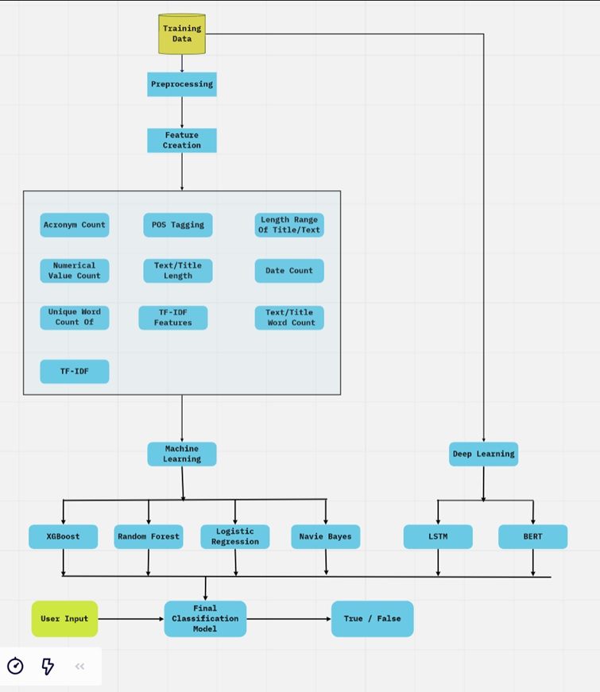
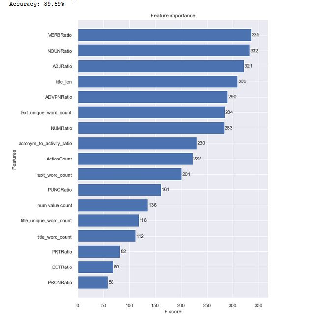

## Architecture

## Problem Statement
	In this project, we have used various natural language processing techniques and machine learning algorithms to classify fake news articles using Machine Learning and Deep Learning models.

###### 	Prerequisites
	Python 3.6
	Libraries: 
	    •	Sklearn (scikit-learn)
	    •	numpy
	    •	scipy
	    •	numpy
	    •	torch
	    •	torchvision
	    •	matplotlib
	    •	tensorflow
	    •	tqdm
	    •	pandas
	    •	numpy
	    •	keras
	    •	sklearn
	    •	nltk

	pip install –r requirement.txt

###### Dataset Description
    •	train.csv: A full training dataset with the following attributes:
        o	id: unique id for a news article
        o	title: the title of a news article
        o	author: author of the news article
        o	text: the text of the article; could be incomplete
        o	label: a label that marks the article as potentially unreliable 
            	1: unreliable
            	0: reliable
    •	test.csv: A testing training dataset with all the same attributes at train.csv without the label.

###### File Structure
	.
	|
	+-- input
	++--  	data
	|   	+-- train.csv
	|   	+-- test.csv
	+-- src
	|   +-- config.py
	|   +-- dataset.py
	|   +-- mlalgorithms.py
	|   +-- engine.py
	|   +-- model.py
	|   +-- predictML.py
	|   +-- train.py
	+-- README.txt
	+-- requirements.txt

###### EDA: 
	Note: Detailed analysis mentioned in the notebook. 
	•	Read file
	•	Check null, duplicate and impute/delete
	•	Feature Creation: 
		o	Text Length
		o	Title Length
		o	Text Word Count
		o	Title Word Count
	•	Feature Creation on clean data : 
		o	clean_text_len
		o	clean_text_word_count
		o	clean_text_title_len
		o	clean_text_title_word_count
	•	Extract POS tag feature and create other:
		o	clean_text
		o	text_len
		o	text_word_count
		o	text_unique_word_count
		o	title_len
		o	title_word_count
		o	title_unique_word_count
		o	VERBRatio
		o	NOUNRatio
		o	PRONRatio
		o	ADJRatio
		o	ADVPNRatio
		o	ADPRatio
		o	CONJRatio
		o	DETRatio
		o	NUMRatio
		o	PRTRatio
		o	PUNCRatio
		o	ActionCount
		o	acronym_to_activity_ratio
		o	acronym count
		o	num value count	
		o	is_len_range_1_500
		o	is_len_range_400_1100
		o	is_len_range_22_80										
	•	Univariate Analysis
		o	Distribution of text length
		o	Distribution of text word count 
		o	Distribution of Title length
		o	Distribution of Title word count 
		o	Check dataset is balanced or not 
		o	Calculate Unigram, Bigram & Trigram of fake and real news and analyze
		    	Before processing
		    	after processing
		o	Process Text and Title of ‘fakenews’, ‘realnews’ dataframe and original data’s dataframe ‘df’ 
		o	Wordcloud graph for ‘fakenews’ and ‘realnews‘	
	•	Bivariate Analysis 
			The distribution of top part-of-speech tags of Text & Title corpus
			Compare text length with label
			Compare text word count with label
			Compare title length with label
			Compare title word count with label
			Compare cleaned text word count with label
			Compare cleaned title word count with label
			Compare author  with label
			*compare the records with label which word count is less than 10
			*compare the records with label which word count is greater than 100
	•	Feature Selection 
	•	Run the xgb and extract features which are important  

### Train Model
###### Model Parameters:
	•	MAX_LEN = 512
	•	TRAIN_BATCH_SIZE = 64
	•	TEST_BATCH_SIZE = 32
	•	EPOCHS = 10
	•	MODEL_PATH = "../input/model/model.pt"
	•	TRAINING_FILE = "../input/data/train.csv"
	•	NEW_TRAINING_FILE = "../input/data/train_with_new_features.csv"
	•	TESTING_FILE = "../input/data/test.csv" 
	•	GLOVE="../input/model/glove.6B.300d.txt"
	•	MODEL_PATH_ML = "../input/model"

###### Machine Learning
	Execute below command to train machine learning models [Random Forest, Navie Bayes, XGBOOST, Logistic Regression and saves the trained model to MODEL_PATH_ML directory
	Python mlalgorithms.py

###### Deep Learning
	Execute below command to train deep learning models [LSTM,BERT] and saves the model to MODEL_PATH directory
	Python train.py

###### Precision: 
###### Recall: 
